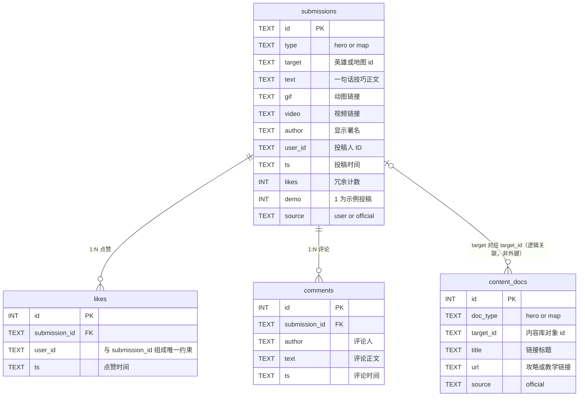

# 加载界面的 30 秒
## 无畏契约「紧急补位速记卡」产品方案

> WeGame Agent 方向 · 个人 AI 作品 · 产品文档（v1.0）

---

## 1. 一句话定义

**临时补位选到不会的英雄时，玩家在加载界面把截图粘贴进工作台，10 秒内获得一张只属于这局对局的速记卡——英雄技能速记 + 本图专属提示（含动图与可点击教学视频链接）。玩家还可以把自己的经验投稿进共享知识库，让内容由社群共建。**

---

## 2. 问题与场景

### 真实痛点（我自己的经历）

- 排位里队友秒锁自己想玩的位置，我被迫补位，选了一个只玩过两三次的英雄——Q/E/C/X 四个技能只能叫出名字，不知道具体怎么用；
- 版本更新后技能改动，凭旧印象打，技能机制已经变了；
- 新手阶段想查"这个 E 到底是位移还是视野"，搜出来的攻略是 20 分钟的进阶教学视频，不是我要的"一行话说清楚"。

### 现有解法为什么不行

| 现有方案 | 问题 |
|---|---|
| Alt-Tab 搜攻略网页 | 打断心流；内容过载；不知道哪篇适配当前版本；5-10 分钟起步 |
| 长视频教学 | 与"我现在就要打这局"的时间预算完全不匹配 |
| 静态速查表 | 无个性化（不知道你选了谁、什么图）；版本更新后过期 |

### 时间窗口洞察

加载界面通常持续 **30–90 秒**。这是整个对局中**唯一**可以安全使用外部工具的窗口——无畏契约的 Vanguard 反作弊是业界最严格的之一，任何游戏内 overlay / 第三方注入工具都有封号风险。

**交互窗口只能开在加载界面，这是反作弊约束下的技术可行性取舍，不是随便选的位置。**

---

## 3. 三个核心产品判断

### 判断一：信息密度服从时间预算

30–90 秒的窗口决定了输出**不能是文章，必须是速记卡**：

- 四个技能各一行一句话（Q/E/C/X 顺序）
- 本图专属提示 ≤3 条（V1 扩展）
- 大招提醒 1 条
- 超出这个信息量 = 没设计好，玩家读不完等于没做

### 判断二：AI 只做识别层，不做内容生成层

教学内容（技能说明、动图、视频）**不允许 AI 生成**：

- 玩家按一条幻觉出来的错误攻略去打这局，会立刻卸载这个工具——教学内容错误成本极高；
- 基础技能说明是稳定、结构化、低频变更的知识，静态化的成本远低于生成后再校验；
- **AI 的价值在识别（截图→英雄+地图）与匹配（对局上下文→该看什么内容），而不是编造内容本身。**

这个"什么该交给 AI、什么不该"的边界，是本作品最重要的架构判断。

### 判断三：保留降级入口，承认 AI 会失败

截图识别一定会失败（相似英雄头像、低分辨率截图、裁切异常）。产品必须内建兜底：识别置信度低或识别错误时，用户**一键选择英雄**继续走完流程，而不是死在 AI 这一环。

---

## 4. 方案与功能范围

### 交付形态：本地工作台 Demo（本次投递，已可运行）

```
顶部横向导航：补位急救站（默认）｜英雄技巧讲解｜地图技巧讲解｜社群投稿

【补位急救站】用户粘贴 / 上传加载界面截图
        ↓
多模态 LLM 识别：英雄名 + 地图名
        ↓
匹配内容库（腾讯 ima 共享知识库 valorantHeroKnow：技能说明 / 地图提示 / 动图 / 教学视频链接）
        ↓
渲染「紧急教程卡」：
  · 英雄：四个技能一行一句话 + 技能动图 + 教学视频（点击跳转）
  · 地图：本图专属提示（含技巧动图）+ 本图攻略视频（点击跳转）
        ↓
识别失败/错误 → 一键选择英雄/地图（降级入口，永远可用）

【英雄技巧讲解 / 地图技巧讲解】轮播滑块（Carousel）：每个英雄/每张地图一张技巧卡
（技能速记 + 提示 + 视频链接），支持箭头/指示点/拖拽翻页与悬停暂停自动轮播，点击「查看速记卡」直达补位急救站对应条目

【社群投稿】玩家提交一句话技巧/动图/视频链接 → 即时进入投稿流
        ↓
投稿流支持点赞 / 评论（互动与留存），最新投稿轮播滑块（自动轮播/交互翻页）
        ↓
导出投稿包 JSON → 人工审核 → 写入 ima 共享知识库 valorantHeroKnow
```

### 工作台信息架构（四栏）

| 栏目 | 核心功能 | 承接的需求 |
|---|---|---|
| **补位急救站**（默认页） | 截图 → 识别 → 速记卡（英雄技能 + 地图提示 + 动图 + 可点击视频）；一键纠正降级入口 | 加载界面 30–90 秒的应急场景 |
| **英雄技巧讲解** | 轮播滑块（Carousel）：每个英雄一张技巧卡，支持箭头/指示点/拖拽翻页与自动轮播，点击直达速记卡 | 非紧急场景的浏览式学习 |
| **地图技巧讲解** | 轮播滑块（Carousel）：每张地图一张技巧卡，支持箭头/指示点/拖拽翻页与自动轮播，点击直达速记卡 | 非紧急场景的浏览式学习 |
| **社群投稿** | 投稿工具 + 投稿流（点赞/评论）+ 最新投稿轮播滑块（自动轮播/交互翻页） | 内容生产与社区互动 |

**内容库存放于腾讯 ima 共享知识库 valorantHeroKnow——已实际入库并验证：当前 17 个条目（库说明 + 7 个英雄（2 决斗者 + 1 哨卫 + 4 先锋，含捷风/贤者/蕾娜/斯凯/黑梦/猎枭/KAY/O）+ 7 张地图 + 2 条用户投稿，均为 Markdown 结构化条目），经 ima OpenAPI 写入，检索接口已验证可按"英雄名/技能/地图"命中，投稿→入库闭环已端到端实测通过。每条入库内容都带来源标注：`source: official`（官网/官方整理，如英雄技能数值、官方 Wiki）或 `source: user`（用户上传，如社群投稿）；用户上传条目随库保存完整元数据——`user_id`（投稿用户ID）、`ts`（投稿时间）、`likes`（点赞数）、`comments`（评论列表）。

### 社群知识共享：从"我整理"到"社群共建"

工具内置投稿入口：玩家选择英雄/地图、写下一句话技巧（可附动图与视频链接），提交后自动携带**来源标注（用户上传）+ 完整元数据（user_id / 时间 / 点赞 / 评论）**，立即进入**投稿流**——支持点赞与评论（数据随投稿保存），并同步出现在对应速记卡中（带「社群投稿」标记、来源标注与署名）；最新投稿通过**轮播滑块（Carousel）**获得曝光。投稿可一键导出投稿包（含全部元数据），经审核后按 ima 条目模板写入共享知识库——**入库内容区分"官网来源"与"用户上传"两类，展示时如实标注**。这解决了单冷启动问题——**我一个人能整理的英雄是有限的，社群的经验是无限的**；点赞/评论让内容产生互动与筛选信号（高赞内容优先曝光，也是未来推荐排序的依据）；内容质量控制放在"人工审核入库"这一环，与"AI 不生成教学内容"的原则一致。

### 范围规划（明确的取舍记录）

| 版本 | 内容 | 状态 |
|---|---|---|
| **M0（本次投递）** | 四栏工作台 Demo：① 补位急救站——截图上传/粘贴 → AI 识别英雄+地图 → 教程卡（英雄技能 + 地图提示 + 动图 + 可点击视频链接）+ 一键纠正降级入口；② 英雄技巧讲解、③ 地图技巧讲解——轮播滑块（Carousel）（每英雄/每地图一张技巧卡，点击直达速记卡）；④ 社群投稿——投稿工具迁入本栏，投稿流支持点赞/评论，最新投稿轮播滑块，投稿自动记录来源标注与元数据（user_id/时间/点赞/评论）；内容库已写入腾讯 ima valorantHeroKnow（17 条：库说明 + 7 英雄（含 4 位先锋：斯凯/黑梦/猎枭/KAY/O）+ 7 地图 + 2 条用户投稿，含来源标注规范，投稿→入库闭环已实测，检索已验证） | 已交付 |
| **V1** | 部署为公开网页（免安装链接，扫码即用）；投稿直连 ima（在线审核流）；RAG 检索 ima 内容语料，按熟练度调节信息密度生成个性化速记卡；高赞投稿进入推荐位 | 迭代方向 |
| **V2** | 并入掌瓦（掌上无畏契约 App）作为功能模块：对局数据接口自动触发，加载界面原生呈现，内容与账号体系打通 | 迭代方向 |
| **砍掉** | 游戏内实时 overlay（封号风险，不做）；全英雄覆盖（先用 Top 10 验证价值） | 明确不做 |

---

## 5. 技术选型与理由

| 环节 | 选型 | 为什么不选另一个 |
|---|---|---|
| 截图识别 | 多模态 LLM API（GPT-4o / Gemini / 混元 Vision 任一），一次调用同时识别英雄与地图 | 传统 OCR + 分类器也可行（加载界面头像位置固定），但换 UI 布局就要重做，泛化差；多模态 LLM 零训练、对分辨率和裁切更鲁棒。Demo 阶段速度优先 |
| 内容层 | 结构化内容库存于**腾讯 ima 共享知识库 valorantHeroKnow**（官方 Wiki 技能说明、官方 B 站教学视频、自录动图、社群投稿），经 ima OpenAPI 检索 | LLM 生成教学内容 = 幻觉风险直接砸在用户最不能出错的环节；自建数据库/表格则没有多人共建与知识库检索能力，ima 共享知识库两者兼得 |
| 前端 | 本地单页工作台（无需安装、无需登录，双击即用） | M0 用本地工作台快速验证核心闭环；独立部署的公开网页列入 V1——先证明"内容+识别+兜底"这条链路成立，再投入部署与分享传播 |

---

## 6. 失败样例与兜底设计

| 失败模式 | 兜底 |
|---|---|
| 相似英雄识别错误（如两个决斗者头像风格接近） | 教程卡顶部常驻"识别错了？换一个"按钮，一键切换；纠正行为被记录，作为识别层的评估数据 |
| 截图分辨率低 / 裁切异常 | 提示重新上传，同时手动选择入口永远可用 |
| 版本更新导致内容过期 | 内容库每条带版本号字段；视频链接做失效检测 |
| （上线后）识别率不达预期 | 纠正日志构成真实测试集，反哺 prompt 迭代或换用 OCR 辅助混合方案 |

> 开发过程中将刻意收集并保留 3–5 个真实失败样例（识别错、识别不出、生成异常），连同修复过程一并展示——失败样例比成功案例更能证明"知道 AI 的边界在哪"。

---

## 7. 评估体系

### 识别层（技术指标）

- **Top-1 识别准确率**：构造 ≥30 张加载截图测试集（不同分辨率 / 不同英雄 / 模糊截图），跑批统计
- **纠正率**：需要用户手动纠正的比例（越低越好，同时是内容质量的代理指标）

### 内容层（产品指标）

- 教程卡停留时长（是否在加载时间内读完）
- 教学视频点击率（CTR）
- 复用率（下次补位是否再次使用——工具价值的直接证据）

### 北极星（若集成进 WeGame 平台）

- 每局加载界面的工具使用率；补位局 vs 常规局的使用率差值（验证"补位"这个切口是否成立）

---

## 8. 局限与迭代方向

**当前局限：**

- 依赖用户手动截图上传，多一步操作（WeGame 平台侧有对局数据接口，可做到选人完成即自动推送，这是平台原生功能相对独立工具的差异化所在）；
- 英雄覆盖 Top 10，未全量。

**迭代方向：**

1. 部署为公开网页（V1）：免安装链接 / 扫码即用，配合"对局结束自动唤起"的分享路径验证传播；
2. RAG + 个性化速记卡（V1）：经 ima OpenAPI 检索内容语料，按玩家分段调节信息密度——新手要"这个技能按 Q、往哪扔"，老手要"这图这个技能的点位"；
3. 对局数据自动触发：选人确定 → 自动生成，加载界面直接展示；
4. 赛后复盘卡（延伸到"社"环节）：本局数据 + AI 复盘建议，可分享到社区。

---

## 9. 与 WeGame 岗位的对应关系

- **"玩"+"社"双环节覆盖**："玩"——选题正中"临时补位"这一具体场景，英雄+地图双维度速记；"社"——社群投稿共建知识库（点赞/评论/轮播曝光的互动体系），正对 JD 中"智能社区"的方向；
- **平衡技术可行性与用户体验**：加载界面窗口 = 反作弊约束下的交互设计；识别用 AI / 内容不用的边界取舍；
- **建立量化评价体系**（JD 具体工作第 5 条）：识别层 + 内容层双层指标设计；点赞/评论数据同时是内容质量的天然评估信号；
- **内容与社区运营意识**（对应"智能社区"与"跨团队协同"）：创作者分层（官方/认证 UP 主/大众投稿）与活动运营方案，体现从工具到社区的产品视野。

---

## 10. 后续迭代计划（产品 × 运营）

### 产品形态演进

| 阶段 | 形态 | 关键收益 |
|---|---|---|
| **V1（短期）** | 独立公开网页部署（免安装链接 / 扫码即用） | 验证传播：把"对局结束自动唤起"做成分享路径，跑通"浏览 → 投稿 → 入库"的 UGC 供给闭环 |
| **V2（中期）** | 并入**掌瓦（掌上无畏契约 App）**作为功能模块 | 平台能力补齐独立工具短板：选人完成 → 对局数据接口自动触发 → 加载界面原生呈现，无需手动截图；内容、账号、好友体系全部打通，"智能游戏伙伴"在移动端落地 |

### 数据架构决策（内容层 / 状态层 / 检索层）

**核心判断：不是"ima 还是 NoSQL"的二选一，而是分层——内容进知识库，状态进数据库，检索按阶段演进。**

| 数据 | 归属层 | 载体 | 为什么放这里 |
|---|---|---|---|
| 英雄/地图知识条目（source: official） | 内容层 | ima 共享知识库 | 低频更新、人工审核入库、给人读 + 给 RAG 检索；零运维、自带语义检索、天然共享 |
| 投稿正文（source: user） | 内容层 | ima（审核后入库） | 内容资产即 RAG 语料，来源可标注，沉淀为全社群共享 |
| 用户ID / 点赞 / 评论 / 审核状态 | 状态层 | NoSQL（M0 用本地存储充当） | 高频读写、按人查、按赞排序、需要条件聚合——是业务状态而非内容 |
| 个性化速记卡（按熟练度调密度） | 检索层 | V2 引入向量索引 / 托管 RAG | 需可编程过滤（按 source / user_id / likes 排序加权），ima 检索接口做不了这么细；ima 退为内容源 |

**分阶段演进：**

- **M0/V1：** ima 即检索——内容 17 条、低频、人工审核，直接用 ima 自带语义检索即可，自建"数据库 + 向量化 + 检索服务"在这个阶段是纯成本；
- **V2：** ima 是内容源而非全部——个性化 RAG 需要"高赞优先、按熟练度调密度、按来源过滤"这类可编程检索逻辑，另起一层向量索引，ima 内容与状态层数据（点赞数）作为输入信号共同喂给检索层。

**当前工作台已按此分层运行**：投稿正文导出 → 审核 → 入 ima（内容层）；点赞/评论/匿名 ID 存本地存储（状态层，M0 的免费 NoSQL 替身）。本决策不是推翻现状，而是把现状固化为有意识的架构选择——这正是面试中"技术选型有依据"的加分点。

**分层已落地为可运行代码（不只是纸面决策）**：状态层已实现"同一套 UI、两种存储"的双模架构——

| 组成 | 实现 | 说明 |
|---|---|---|
| 前端数据访问层 | `DataService`（工作台内） | 界面只认这一层接口（list / add / like / comment / clear / reset / docs / export），换存储实现不动任何 UI 代码 |
| 本机模式 | `localStorage` | 零部署、离线可用，M0 阶段的状态层替身 |
| 后端模式 | `backend/server.py` + `valorant_community.db` | 零依赖 Python（仅标准库 `http.server` + `sqlite3`）REST API，状态层真正落到 SQLite |
| 降级策略 | 自动回落 | 后端不可达时 6 秒超时后自动切回本机模式并提示，功能完全不受影响 |

两个关键实现细节（面试可直接讲）：
- **点赞幂等**：靠 `likes` 表 `UNIQUE(submission_id, user_id)` 约束，计数只在状态真正变化时增减——重复点击或网络重试都不会导致计数漂移。实测连点 3 次计数稳定为 1。
- **乐观更新 + 失败回滚**：点赞/评论先更新 UI 再发请求，失败则回滚并提示，避免网络延迟造成"点了没反应"。评论以服务端返回的完整列表替换本地占位，保证两种模式下都不会重复插入。

这套双模架构的意义：它证明"状态层迟早要独立成库"这个判断不是空话——M0 用 localStorage 顶着，V1 换成 SQLite 时**界面代码零改动**，只需新增一个存储实现。这正是分层设计的价值所在。

**数据模型（ER 图）**



> 静态版 ER 图（离线可看、可直接放进 PPT）：`screenshots/er_diagram.svg`

这张图里三个值得讲的设计判断：

| 设计点 | 做法 | 为什么这么设计 |
|---|---|---|
| **点赞幂等** | `likes` 表独立成表 + `UNIQUE(submission_id, user_id)` | 如果用「点赞数 + 一个 liked 数组」存在投稿行里，并发点赞会覆盖、计数会漂移。拆成表后靠数据库约束保证一个人只能点一次，计数只在状态真正变化时增减 |
| **计数冗余** | `submissions.likes` 存冗余计数，同时保留 `likes` 明细表 | 列表页要按赞排序，每次 `COUNT(*)` 太慢；冗余字段用于读，明细表用于对账与去重，两者不一致时以明细表为准 |
| **内容层不建外键** | `content_docs.target_id` 与 `submissions.target` 只做逻辑关联 | 内容层是低频只读数据（官方攻略链接），状态层是高频读写数据，二者更新频率差两个数量级。强行建外键会让内容更新被业务写入阻塞——这正是"内容层 / 状态层分离"在表结构上的体现 |

**面试高频追问 → 直接照搬话术（30-60 秒）**

| 追问 | 答（先结论再展开） |
|---|---|
| **Q1：为什么用 SQLite 而不用 MySQL？** | "**结论：M0 阶段用 SQLite 因为零运维、单文件、随产品走。** 我不需要一台独立数据库服务器，文件跟项目一起走、面试官拿到就能打开看；并发写我用进程内锁串行化解决。等真上 WeGame 平台，用户量起来后，迁移到 MySQL/Postgres 改的是 `backend/server.py` 的连接串，业务代码零改动——这就是分层抽象的红利。" |
| **Q2：为什么 4 张表不分更多？** | "**结论：4 张表正好对应一个最小可观测闭环——内容、投稿、点赞、评论。** 多分表会增加跨表 JOIN，比如把 author 单独成表，每次查投稿都要 JOIN；但当前场景一个投稿就是一个 author，没有 1:N 关系，强行拆表是过度设计。**判断标准就一条：拆表后能否减少 JOIN 或支持独立扩展，否则就是没必要的复杂度。**" |
| **Q3：M1/M2 怎么扩？** | "**M1 加 `tags` 表（投稿-标签 N:N）+ `reports` 表（举报）；M2 加 `notifications` 表（关注流推送）。** 关键看是否产生新的独立查询维度。tags 让用户能按主题过滤投稿，reports 需要独立的状态机（待审 / 已处理 / 已驳回），notifications 涉及跨用户的消息聚合——这些都是单表撑不下的查询模式，扩表就有理由。**反之 likes 和 comments 现在不扩**，因为单 submission_id 查询 + 倒序排序足够。"|

**面试讲解口径（30 秒）：**

> "内容与状态分离：内容进知识库做 RAG 语料、带来源标注，状态进数据库做产品逻辑。M0 用 ima 是因为低频、人工审核、零运维；等做个性化检索再加向量层，ima 仍是内容源。"

### 内容供给（创作者生态）

- **邀请头部 UP 主 / 视频博主入驻投稿**：创作者投稿带「认证」标记、署名与主页跳转（粉丝引流激励），把平台的浏览流量转化为创作者的投稿动机；与"高赞投稿进入推荐位"形成双向激励；
- **内容三层分级**：官方整理层（可信基线）+ 认证创作者层（KOL 技巧）+ 大众投稿层（长尾 UGC），三层审核标准不同，保证质量的同时不堵塞供给。

### 活动运营（预备方案）

- **主题技巧征集赛**：围绕版本热点命题（如"本版本最强 A 点进攻套路"），获奖投稿进入官方内容库并署名展示；
- **赛季投稿打卡**：每个赛季一个投稿主题，累计投稿解锁限定称号/头像框（游戏内激励需与平台运营协同）；
- **精华上首页**：高赞投稿自动进入「补位急救站」推荐位，让优质内容获得曝光，形成"投稿 → 点赞 → 曝光 → 再投稿"的内容正循环。

---

## 附录：一天搭建排期

| 时间 | 任务 | 交付 |
|---|---|---|
| 上午 | 整理 Top 10 英雄内容库（结构化数据，存入腾讯 ima）；多模态识别链路跑通（截图→英雄名） | ima 内容库 + 识别链路 |
| 下午 | 本地工作台：上传/粘贴 → 识别 → 渲染教程卡（动图 + 视频链接）；一键纠正入口 | 可运行 Demo |
| 晚上 | 收集 3 个失败样例并修复一轮；录 2–3 分钟 Demo 视频；导出本文档 PDF；提交 | 投递包 |
